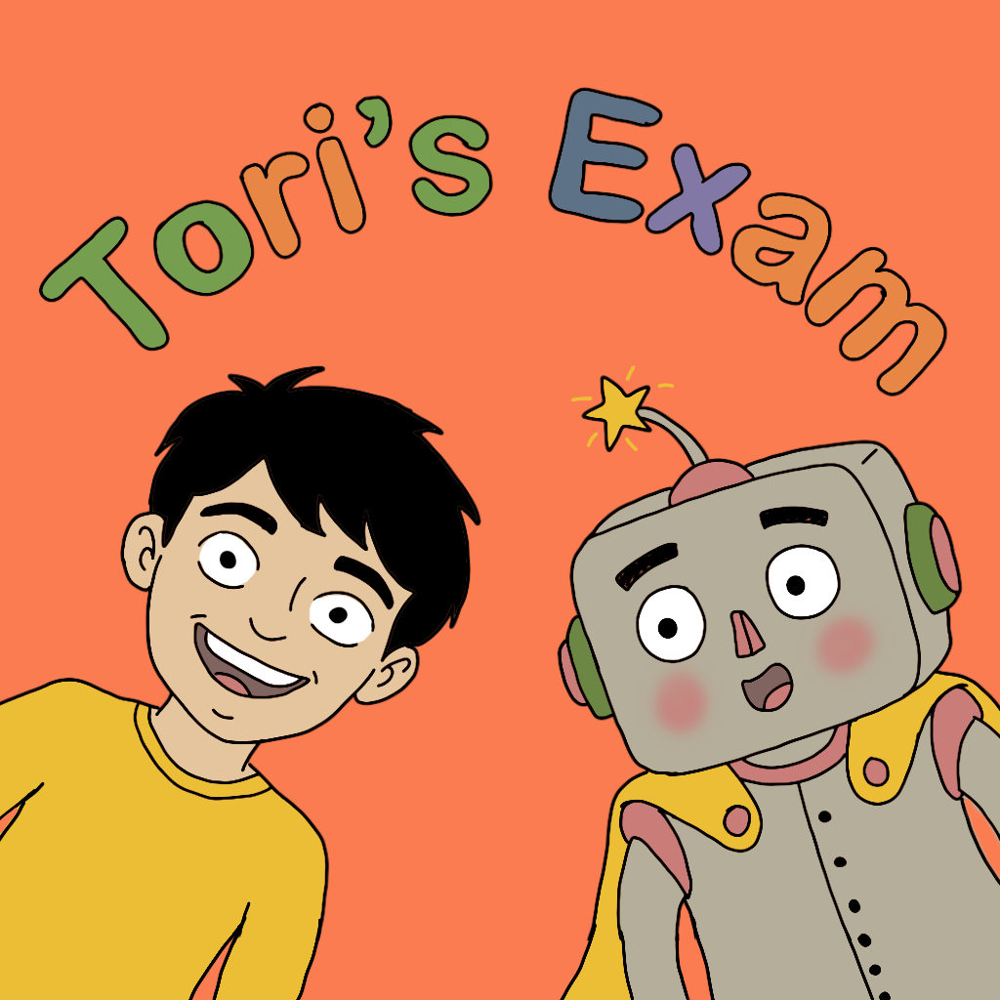

<p align="center">
  
</p>

# Tori's Exam

> **Learn Object-Oriented Programming through an interactive story game**


---

## What is Tori's Exam?

**Tori's Exam** is a story-driven iPad game that teaches the **four pillars of Object-Oriented Programming** through everyday activities. Instead of reading dry textbook definitions, you join Tori — a student preparing for his OOP exam — and learn by doing.

A friendly robot companion guides Tori (and you!) through each concept, while a **live code panel** shows real Swift code updating as you interact with the game.
https://www.youtube.com/watch?v=qNy1T965_d8

---

## The Journey

| Scene | What Happens | OOP Concept |
|-------|-------------|-------------|
| **Bedroom** | Tori wakes up panicking about his exam | *Story Introduction* |
| **Robot Intro** | Robot friend arrives to help teach OOP | *What is OOP?* |
| **Closet** | Drag & drop clothes onto Tori | **Classes & Objects** |
| **Kitchen** | Cook pasta step by step | **Encapsulation** |
| **Kitchen+** | Follow recipes, make variations | **Inheritance & Polymorphism** |
| **Blueprint** | See how classes abstract real things | **Abstraction** |
| **Bus Ride** | Head to school for the exam | *Transition* |
| **Exam Hall** | AI-generated OOP exam | **Assessment** |
| **Theory** | Revisit all concepts anytime | **Revision** |

---

## Key Features

- **Learn by Playing** — Each OOP concept is mapped to a relatable daily activity
- **Live Code Panel** — See Swift code update in real-time as you interact with scenes
- **AI-Powered Exam** — Apple Intelligence generates unique questions every attempt
- **Smart Fallback** — Curated exam for devices without Foundation Models
- **Hand-drawn Art** — Original character and environment illustrations
- **Background Music** — Immersive audio with toggle controls
- **Visual Feedback** — Confetti, glowing hints, and animated pointers guide you
- **Revision Mode** — Review all OOP concepts after completing the story

---

## Tech Stack

| Technology | Purpose |
|-----------|---------|
| **SpriteKit** | Interactive game scenes, animations, drag-and-drop |
| **SwiftUI** | Exam UI, menus, theory pages, overlays |
| **Foundation Models** | On-device AI exam generation via `@Generable` |
| **AVFoundation** | Background music playback |
| **Swift 6** | Modern concurrency and language features |

---

## Project Structure

```
TorisExam.swiftpm/
├── MyApp.swift                          # App entry point
├── ContentView.swift                    # Root view & scene navigation
├── GameState.swift                      # Global game state management
├── SceneRegistry.swift                  # Scene routing & transitions
├── Package.swift                        # Swift Package configuration
│
├── Scenes/
│   ├── BaseScene.swift                  # Shared scene foundation
│   ├── MainMenuScene.swift              # Main menu
│   ├── BedroomScene.swift               # Wake up scene
│   ├── RobotIntroScene.swift            # Meet the robot
│   ├── OOPIntroScene.swift              # OOP introduction
│   ├── ClosetScene.swift                # Classes & Objects
│   ├── KitchenScene.swift               # Kitchen base
│   ├── KitchenScene+Encapsulation.swift # Encapsulation lesson
│   ├── KitchenScene+Inheritance.swift   # Inheritance lesson
│   ├── KitchenScene+Polymorphism.swift  # Polymorphism lesson
│   ├── KitchenScene+Abstraction.swift   # Abstraction lesson
│   ├── BlueprintScene.swift             # Blueprint visualization
│   ├── BusScene.swift                   # Bus ride to school
│   ├── ClockScene.swift                 # Clock interaction
│   └── ThankYouScene.swift              # Completion screen
│
├── Views/
│   ├── MainMenuView.swift               # SwiftUI main menu
│   ├── ExamHallView.swift               # AI-powered exam
│   └── TheoryView.swift                 # Revision section
│
├── Components/
│   ├── DialogBox.swift                  # Story dialog system
│   ├── InstructionsView.swift           # How-to-play overlay
│   ├── PauseMenuView.swift              # Pause menu
│   ├── CreditsView.swift                # Credits screen
│   └── PersistentSpriteView.swift       # SpriteKit view wrapper
│
├── Utils/
│   ├── AudioManager.swift               # Music playback manager
│   └── SyntaxHighlighter.swift          # Code panel highlighting
│
└── Assets.xcassets/                     # All images, icons & audio
```

---

## Getting Started

### Requirements
- **Xcode 26** (beta) or later
- **iPadOS 18.0+**
- iPad Simulator or physical iPad

### Run
```bash
git clone https://github.com/Kartikayy007/TorisExam.git
cd TorisExam
open TorisExam.swiftpm
```

> **Note:** Apple Intelligence features (AI exam generation) require **iPadOS 26+** on supported devices. On older versions, a curated fallback exam is used automatically.

---

## OOP Concepts Taught

<details>
<summary><b>Classes & Objects</b> — The Closet Scene</summary>
<br>
Pick clothes for Tori by dragging items from the closet. Each clothing item is an <b>Object</b> created from the <b>Clothing Class</b>. Properties like <code>color</code> and <code>size</code> are set when you choose, and the <code>tryOn()</code> method is called.
</details>

<details>
<summary><b>Encapsulation</b> — The Kitchen Scene</summary>
<br>
Cook pasta step by step. The recipe <b>encapsulates</b> the complex cooking process — you interact with a simple interface (add water, boil, strain) while the internal details are hidden.
</details>

<details>
<summary><b>Inheritance</b> — Recipe Variations</summary>
<br>
Different recipes <b>inherit</b> from a base Recipe class. Mac & cheese inherits the base cooking steps but adds its own ingredients — just like subclasses extend parent classes.
</details>

<details>
<summary><b>Polymorphism</b> — Cooking Methods</summary>
<br>
The same <code>cook()</code> method behaves differently depending on the recipe. Boiling pasta vs. making a sandwich — same action name, different behavior. That's <b>polymorphism</b>.
</details>

<details>
<summary><b>Abstraction</b> — The Blueprint</summary>
<br>
See how real-world objects are <b>abstracted</b> into code. A complex kitchen becomes a simple class with only the essential properties and methods exposed.
</details>

---

## The AI Exam

The final exam is powered by **Apple Intelligence Foundation Models**, running entirely on-device:

- **Unique questions every time** — no memorizing answers
- **Instant scoring** with color-coded feedback
- **Written explanations** for correct answers
- **Retake anytime** to test your understanding
- **Offline** — no network connection needed

---

## Credits

**Developed by** — Kartikay  
**Art & Design** — Original hand-drawn illustrations by Kartikay  
**Music** — "Go to the Picnic" by Loyalty Freak Music ([CC0 License](https://creativecommons.org/publicdomain/zero/1.0/))  
**Bus Scenery** — Free vector graphic from [Vecteezy](https://www.vecteezy.com)  

---

## License

This project was created for the **Apple Swift Student Challenge 2026**.

---

<p align="center">
  <i>Built with Swift, SpriteKit, SwiftUI & Apple Intelligence</i>
</p>
